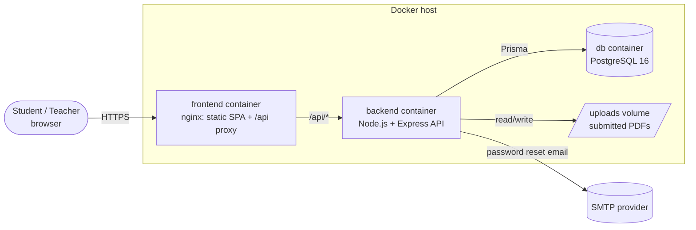
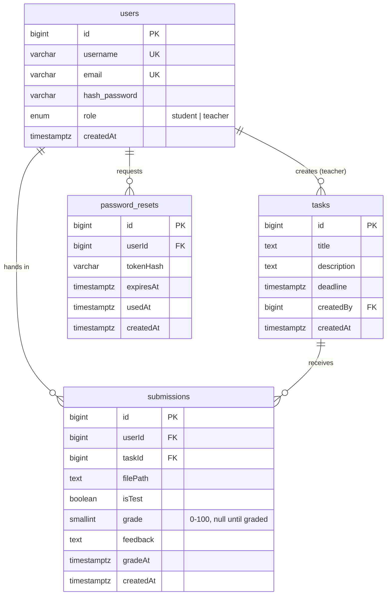
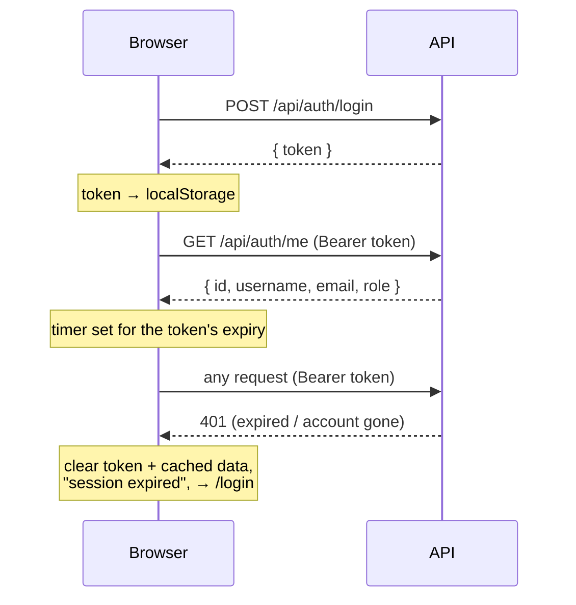
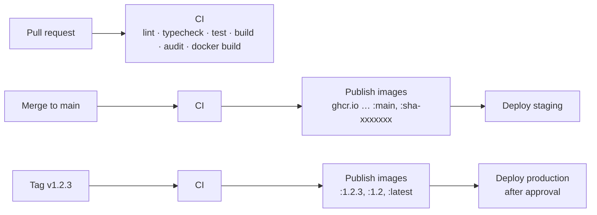

# Architecture

How Task Grading Hub is put together, and why. For setup see the
[README](../README.md); for operations see [deployment.md](deployment.md).

## System overview



- **One origin.** The browser only talks to nginx. nginx serves the built
  React app and forwards `/api/*` to the backend, so there is no CORS in
  production and the API port is never exposed.
- **Stateless API.** Every request carries a JWT; any number of backend
  containers could run, as long as they share the database and the uploads
  volume.
- **Files on disk.** PDFs are written to `UPLOAD_DIR` (a Docker volume); the
  database stores the path. Deleting a task or submission deletes its files.

## Backend

Express 4 + TypeScript, layered so each layer has one job:

```
routes/        URL + middleware chain (authenticate → authorize(role) → validate → upload)
controllers/   parse the request, call a service, send the response
services/      business rules: deadlines, ownership, hiding existence behind 404
repositories/  Prisma queries only
validators/    zod schemas (request bodies and query strings)
utils/         JWT, bcrypt/reset tokens, DTO serialisation (BigInt → number)
```

Rules worth knowing:

- **Ownership-sensitive reads answer 404, not 403**, so users can't discover
  other people's submissions or tasks' grading lists. Updating or deleting
  another teacher's task is a 403 because task existence isn't secret.
- **One submission per student per task** is enforced twice: in the service
  (friendly 409) and by a partial unique index
  `("userId","taskId") WHERE "isTest" = false` that catches races. Prisma
  can't express partial indexes; see
  [backend/prisma/PARTIAL_INDEX_NOTE.md](../backend/prisma/PARTIAL_INDEX_NOTE.md).
- **Uploads** go through multer: PDF MIME type, 10 MB, one `file` field.
  Role and id are checked *before* multer runs, and any failure afterwards
  deletes the written file, so rejected requests leave nothing on disk.
- **Password resets** store only a SHA-256 hash of the token, expire after
  30 minutes and are single-use. The response never reveals whether an
  email exists.

### Data model



All foreign keys cascade on delete. Grades are columns on `submissions`
(at most one grade per submission, re-grading overwrites).

## Frontend

React 19 single-page app built with Vite, in TypeScript strict mode.

| Concern | Choice | Why |
|---|---|---|
| Routing | React Router 7 data router, one lazy chunk per page | Deep links, scroll restoration, small first load |
| Server state | TanStack Query | Caching, background refresh, request de-duplication, cache invalidation after mutations |
| Session | `AuthProvider` context + token in `localStorage` | Survives reloads; see the trade-off below |
| Forms | React Hook Form + zod | Same validation library and limits as the backend |
| Styling | Tailwind CSS 4 | No custom CSS files to maintain; consistent spacing and colours |
| Notifications | sonner toasts | Accessible, small |
| Tests | Vitest + Testing Library + MSW | Real pages and router against a fake API that follows the backend's rules |

```
src/
  api/          fetch wrapper (auth header, error parsing, 401 handling), endpoints, types
  auth/         AuthProvider, useAuth, route guards, token storage, JWT expiry
  components/   UI kit (Button, Field, Card, Alert, ConfirmDialog, …) and layouts
  features/     auth, tasks, submissions: pages, their hooks and schemas
  lib/          dates, files, error messages, small hooks
  pages/        not found / no access / error screens
  test/         fake API (MSW), in-memory data, render helper
```

### Session handling



- On startup a stored token is checked locally for expiry, then with
  `/auth/me`. A network failure shows a "can't reach the server" screen
  rather than signing the user out.
- A `storage` event listener keeps every open tab on the same session.
- **Trade-off:** a token in `localStorage` is readable by any script on the
  page. The strict Content-Security-Policy (`script-src 'self'`) and React's
  escaping make script injection unlikely; an httpOnly cookie would remove
  the risk but needs CSRF protection and backend changes. Listed as future
  work in the [requirements](frontend-requirements.md#9-out-of-scope-and-future-work).

### Why a fake API in tests

Component tests render the real router, pages and data layer. Network calls
are answered by [`src/test/handlers.ts`](../frontend/src/test/handlers.ts),
an in-memory imitation of the backend with the same rules and error
messages. Tests read like user stories ("student uploads a PDF, then sees
it as submitted") and don't need a database. The backend's own integration
tests cover the real API against PostgreSQL.

## Delivery



Details, secrets and rollback: [deployment.md](deployment.md).

## Decisions

The six product decisions are in the
[backend README](../backend/README.md#decisions-locked-in). Technical ones:

| # | Decision | Alternatives considered | Reason |
|---|---|---|---|
| T1 | nginx serves the SPA and proxies `/api` (same origin) | Separate API domain with CORS | No CORS or cookie-domain issues, one TLS certificate, API not exposed |
| T2 | JWT in `localStorage` | httpOnly cookie | Works with the existing stateless API; risk mitigated by CSP (see above) |
| T3 | Files on a Docker volume | Object storage (S3, R2) | Single-server deployment; the service layer isolates file access if this needs to change |
| T4 | Migrations run when the backend container starts | Separate release job | One command deploys; `RUN_MIGRATIONS=false` switches it off for multi-instance setups |
| T5 | Images published to GitHub Container Registry | Docker Hub | Same place as the code and CI, permissions follow the repository |
| T6 | Pages lazy-loaded per route | Single bundle | Initial JS 87 KB gzip instead of 163 KB |
